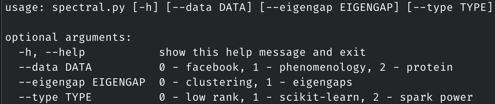

# Ex 1 - Spectral Graph Partitioning Implementations

the file `spectral.py` contains options to run all 3 algorithms to the first exercise.

## How to run 



    --data to choose what dataset to use:
        0: smallest, 1:medium, 2:largest, 
            default = 0

    --eigengap to choose what to perform:
        0: clustering, 1:eigengap peaks
            default = 0

    --type to choose what algorithm to use:
        0: low rank representation, 1:scikit-learn spectral clustering, 2:Spark power iteration clustering
            default = 0

Example for clustering:

```
python3 spectral.py --type 1
```

Example to check eigengaps:
```
python3 spectral.py --eigengap 1
```

In this case, the image will be saved inside the `eigengaps` folder.


## NOTE: Only the smallest dataset will plot a graph.